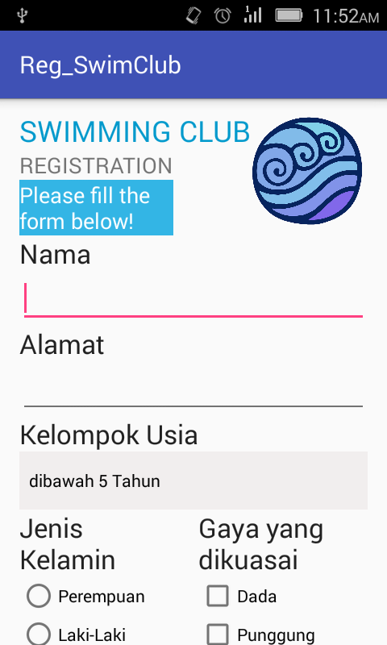
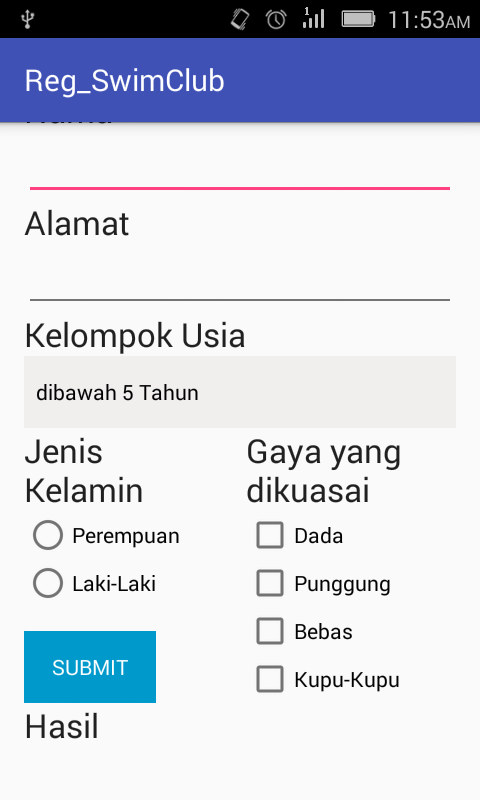
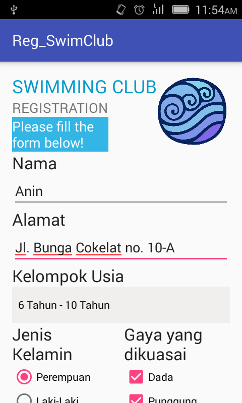
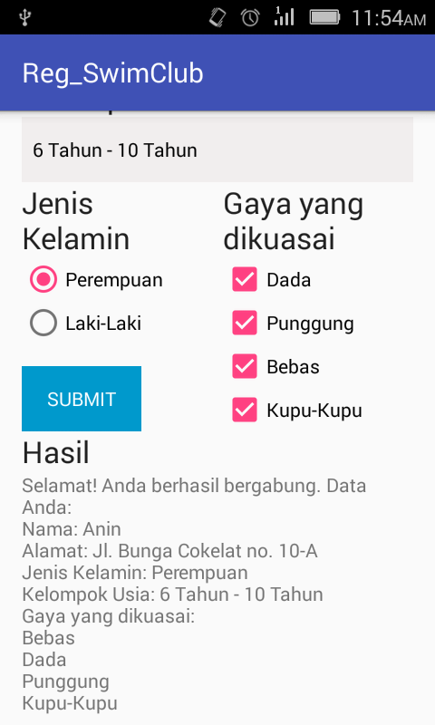

# Reg_SwimClub

>Penjelasan

Aplikasi ini digunakan untuk pendaftaran menjadi anggota sebuah klub renang.

Data yang perlu di-inputkan adalah nama, alamat, kelompok usia, jenis kelamin dan gaya yang dikuasai.

Deteksi kesalahan dengan menggunakan tulisan "Form ada yang belum terisi!" dibawah Hasil.

>Screenshoot

>[Link APK](https://drive.google.com/open?id=0B5OEManDZVFiOVJJNFVmRk8zZnM)

>Identitas

#### *Annisa Rachmadiyanti*
XII RPL 5 / 04

**4295/1193.070**
### SMK TELKOM MALANG
